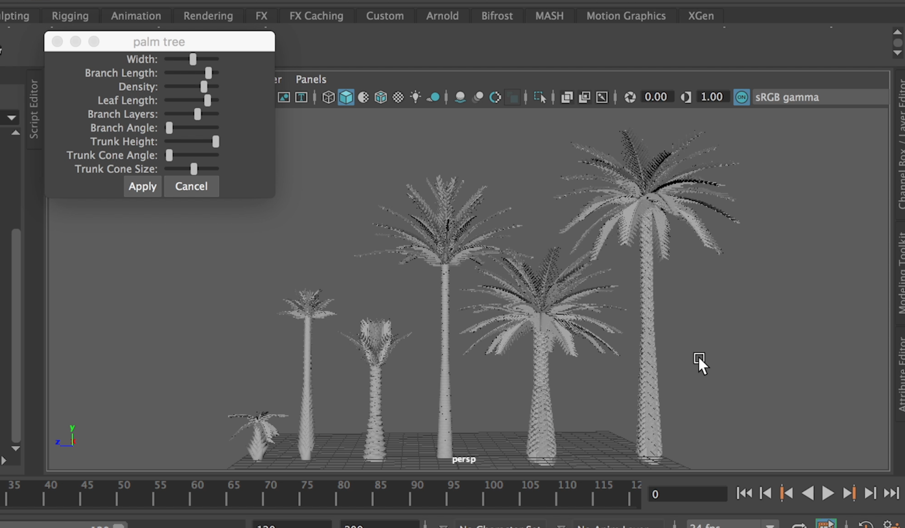

# Palm Tree Generator  

This is a tool for Maya that creates palm trees. Users specifiy the branch width, branch length, branch density, leaf length, branch layers, branch angle, trunk height, trunk cone angle, and trunk cone size.

To see the tool in action: https://www.youtube.com/watch?v=MBka0ZQCc7M

